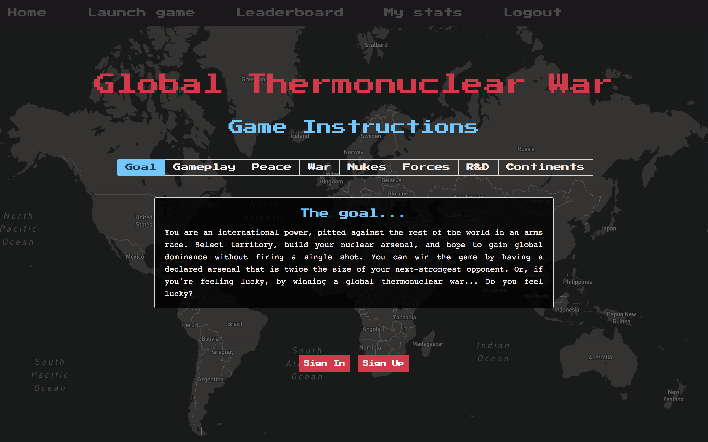

## Global Thermonuclear War

Our team's capstone project for Galvanize Web Development Immersive program.

Global Thermonuclear War is a full-stack board game, played across multiple devices,
where you are an international power locked in an arms race with the rest of the world.
Our team wanted to build a game that took full advantage of technologies like mobile
devices, video projectors, and cameras while also having the in-person social
interaction of a traditional board game.

## Roles

Tom - Dart & Flutter / Mobile    
Steven - Front End with Jason / Mobile with Tom    
Gavin - Chaos Team / Game mechanics    
Jason - Phaser / Motion & animation    
Lance - Physical & material / user API / AWS deployment

## Project Links

Deployed site: https://gtnwthegame.com/

Wiki for Instructions, Game design and Dev docs: https://github.com/LanceHunter/Capstone-Game/wiki

Game & Language Architecture:

Web Application:

## Build Tools / Stack

Flutter, Vue.js, Phaser.js, Tracking.js, Firebase, PostgreSQL, Bulma, KOA, Waffle.io, AWS EC2

1. Mobile app written in **Flutter**.
2. Projected game board using **Vue.js** and **Phaser.js**.
3. Webcam and **Tracking.js** to track player interaction with the projected board.
4. Realtime **Firebase** database to sync gamestate between physical devices.
5. **PostgreSQL** database for storing account info and player statistics.
6. Full stack website with **Vue.js** and **Bulma** to create games and view player stats.
7. **KOA** server to coordinate communication between components.
8. **Waffle.io** for user stories and project management.
9. Project hosted on **Amazon EC2**.

## Initial Expected Challenges

1. API working cross platform
2. Code management / deployment pipeline
3. Actual game design
4. Game API for live calls / sockets
5. Hardware / projector
6. Tracking
7. User interface
8. Mobile UI
9. AI programming
10. Deployment / AWS
